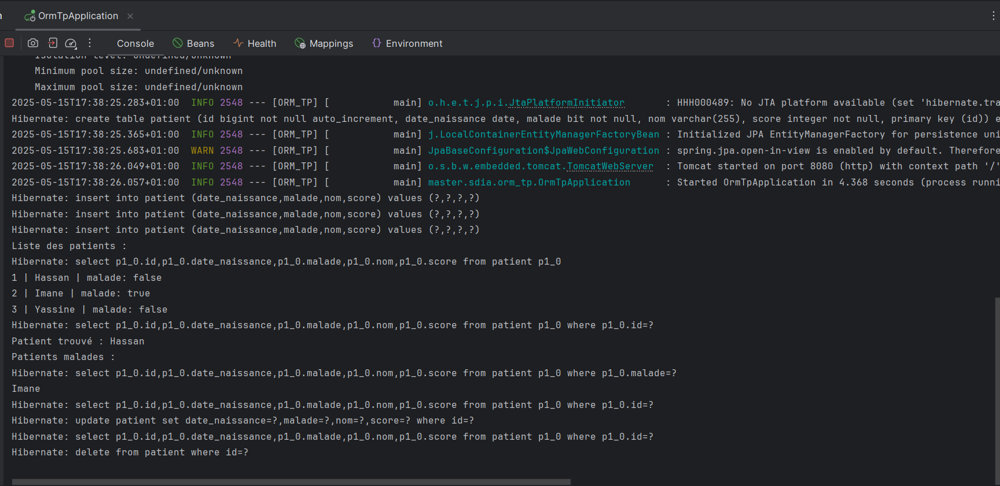

# ORM_TP

Ce projet Spring Boot est une application de gestion de patients utilisant la technologie **JPA avec Hibernate**. Il illustre comment manipuler des entités et persister les données en base, d’abord avec **H2**, puis après migration vers **MySQL**. Il inclut également une gestion plus avancée de la base avec des entités telles que `Médecin`, `RendezVous`, `Consultation`.

---

---

## 📑 Table des matières

- [Partie 1 : Création de la base de données avec Hibernate](#partie-1--création-de-la-base-de-données-avec-hibernate)
- [Partie 2 : Migration vers MySQL](#partie-2--migration-vers-mysql)
- [Partie 3 : Ajout des entités avancées et manipulation des données](#partie-3--ajout-des-entités-avancées-et-manipulation-des-données)
- 
---

## Partie 1 : Création de la base de données avec Hibernate

- Définition de l'entité `Patient` avec ses attributs : `id`, `nom`, `dateNaissance`, `malade`, `score`.
- Utilisation de Spring Data JPA pour gérer la persistance des patients.
- Implémentation des opérations CRUD basiques via un repository.
- Test des opérations via un `CommandLineRunner` pour insérer, afficher, rechercher et supprimer des patients.

---

## Partie 2 : Migration vers MySQL

- Passage de la base H2 en mémoire vers une base relationnelle MySQL.
- Configuration dans `application.properties` pour connecter l'application à MySQL.
- Gestion automatique des mises à jour du schéma avec `ddl-auto=update`.
  

---

## Partie 3 : Ajout des entités avancées et manipulation des données

- Ajout des entités `Medecin`, `RendezVous` et `Consultation` pour modéliser un système médical complet.
- Relations entre entités :
  - `RendezVous` associe un patient et un médecin.
  - `Consultation` est liée à un rendez-vous.
- Manipulation des données avec ces nouvelles entités via JPA et repository.
  

